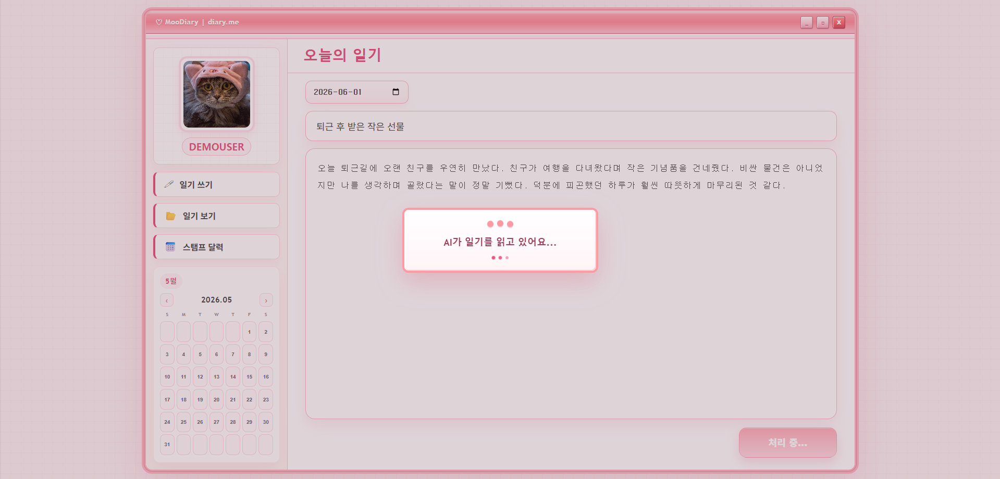
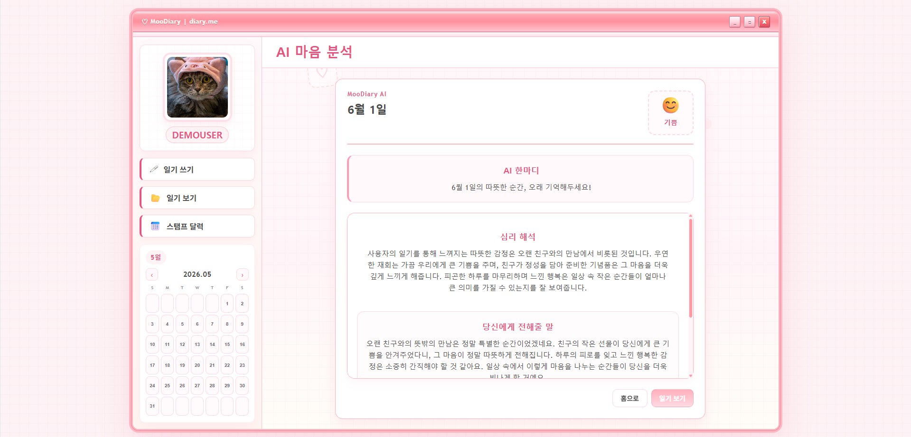
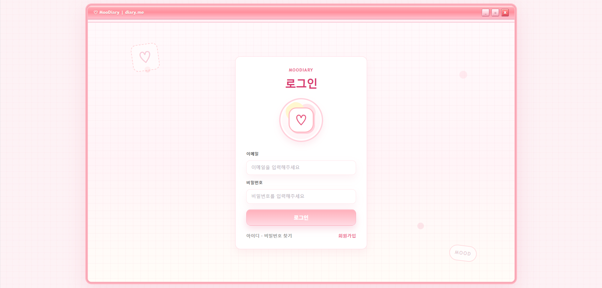
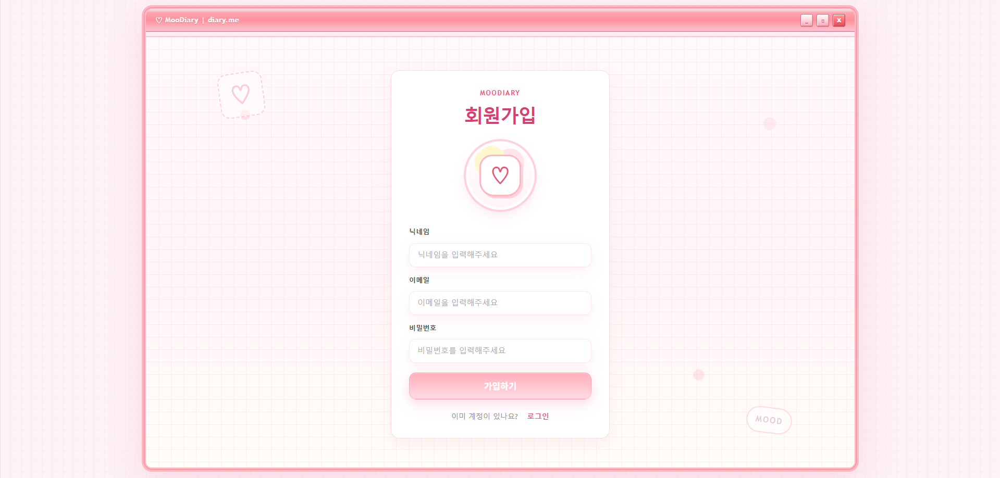
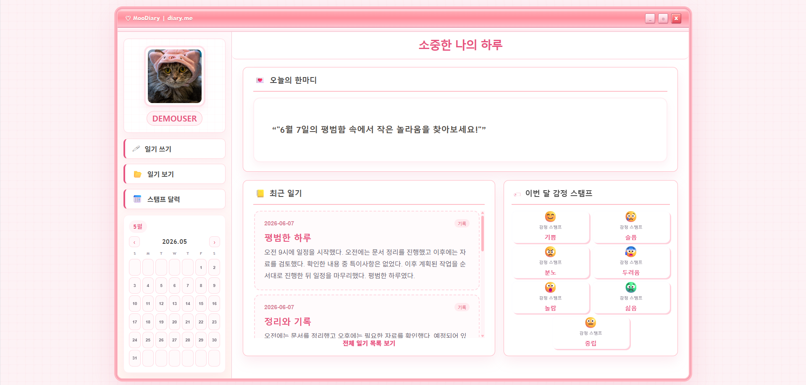
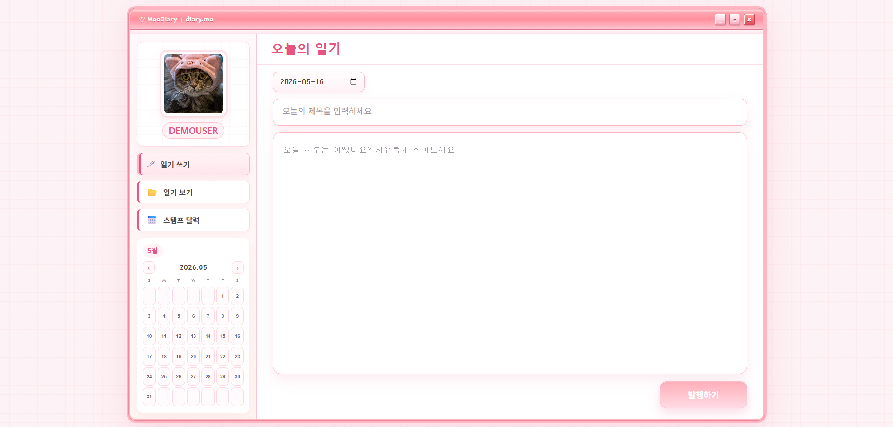
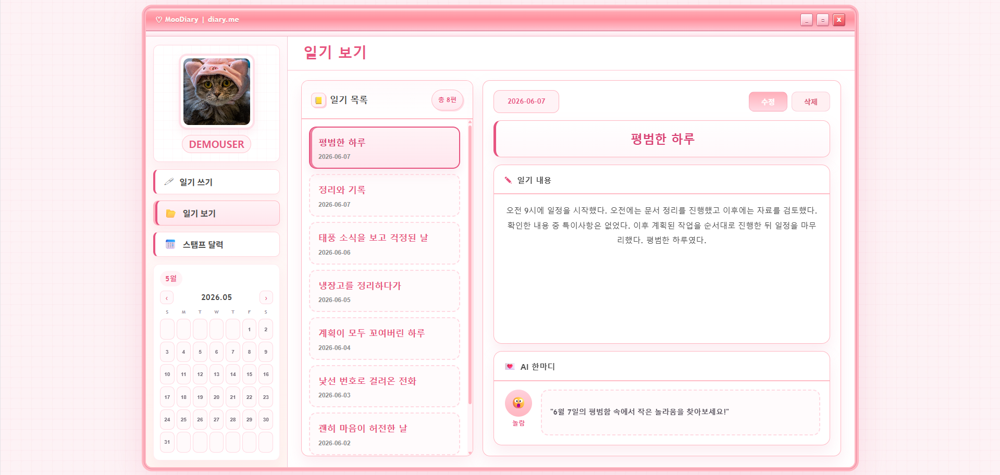
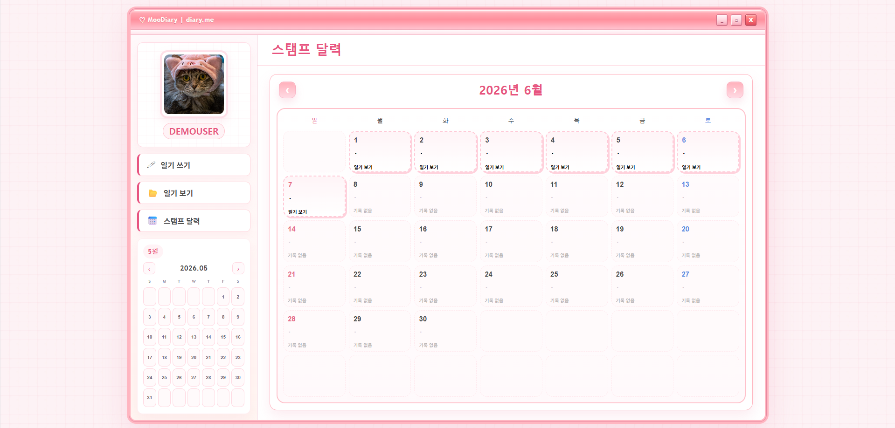

[🇰🇷 한국어 README](README.md)

# MooDiary

AIによる感情分析機能を搭載した日記サービス

## プロジェクト概要

MooDiaryは、ユーザーが日々の出来事を記録し、自分の感情を振り返ることができるAI感情分析日記サービスです。

ユーザーは日記の作成・閲覧・編集・削除が可能であり、日記作成時にはAIが内容を分析し、感情分析結果と共感メッセージを提供します。

また、カレンダー画面では日記を書いた日付を確認でき、特定の日付を選択することで、その日に作成した日記一覧を閲覧できます。

---

## 開発期間

2026.03 ～ 2026.06

---

## 技術スタック

### Frontend

* React
* Vite
* React Router DOM
* CSS

### Design

* Figma
* Stitch

### Backend

* Spring Boot
* JWT Authentication

### AI

* Hugging Face Space ベースの AI API

### Frontend Deployment

* Vercel

---

## 主な機能

### 会員登録 / ログイン

* JWT認証によるユーザー認証
* ログイン状態の維持

### 日記管理

* 日記作成
* 日記閲覧
* 日記編集
* 日記削除

### AI感情分析

* 日記内容をAIサーバーへ送信
* 感情分析結果を表示

感情分類

* Joy
* Sadness
* Anger
* Fear
* Surprise
* Disgust
* Neutral

### AI共感メッセージ

* 感情分析結果に基づく共感メッセージを表示
* AIコメント生成

### 感情分析結果

* 感情スタンプ表示
* 感情タイプの可視化

### カレンダー機能

* 日記作成日を表示
* 特定の日付の日記一覧を表示

### AI分析フロー

1. 日記を作成
2. AIサーバーへリクエスト送信
3. ローディングモーダルを表示
4. 感情分析結果を受信
5. AIコメントおよび感情スタンプを表示

#### AI分析中

#### AI分析結果

---

## 画面構成

### ログイン

* JWT認証によるログイン
* ログイン状態の維持

### 会員登録

* ユーザーアカウント作成
* ニックネームおよびアカウント情報入力

### ホーム

* 最新の日記を表示
* AIからの一言を表示
* 作成日および感情情報を表示

### 日記作成

* 日記の作成・保存
* AI感情分析結果の確認
* AI共感メッセージの確認

### 日記一覧

* 作成した日記の閲覧
* 日記詳細の確認

### スタンプカレンダー

* 日記作成日の確認
* 特定の日付の日記一覧を表示

### AI分析結果

* 感情分析結果の確認
* AI共感メッセージの確認

---

## 担当した役割

### Frontend

* Reactを用いたフロントエンド画面全体の実装
* React Routerによるページルーティング構成
* バックエンドAPI連携
* JWT認証機能の実装
* AI API連携
* 日記CRUD機能の実装
* Vercelへのデプロイおよび動作検証

### UI/UX設計・リデザイン

* Figmaによる初期UI設計
* Stitchを活用したUIリデザイン
* サービス全体のUI実装および改善
* レトロなピンクテーマデザインの適用
* ログイン・会員登録画面のリデザイン
* ホーム画面レイアウト改善
* 共通AppModalコンポーネントの設計・適用
* AIローディングモーダルおよび結果画面UI実装
* カレンダーおよび感情確認画面のUI改善
* ユーザー体験（UX）の改善

---

## 開発プロセス

1. Figmaを活用した初期UIデザインの作成
2. ReactによるMVPの実装およびデプロイ
3. ログイン機能および日記CRUD機能の実装
4. Stitchを活用したUIリデザイン
5. AI API連携および結果画面の実装
6. 共通モーダル導入によるユーザー体験の改善
7. 最終UI調整およびデプロイ

---

## トラブルシューティング

### 1. 日記作成日とカレンダー表示日の不一致

#### 問題

ユーザーが選択した日記作成日と、カレンダー上に表示される日付が一致しない問題が発生した。

#### 原因

カレンダーでは日記作成日（postDate）ではなく、サーバー生成日時（createdAt）を基準としてデータを表示していた。

#### 解決方法

日付処理ロジックを修正し、ユーザーが選択した作成日（postDate）を優先的に使用するよう改善した。また、カレンダーでも実際の作成日を基準に日記データを取得するよう修正した。

---

### 2. 日記が存在しない日付もクリックできる問題

#### 問題

スタンプカレンダーにおいて、実際には日記が存在しない日付でもクリック可能となっており、遷移先で空画面が表示される問題が発生した。

#### 原因

日付の有効判定を実際の日記データではなく、表示用データを基準に行っていた。

#### 解決方法

実際の日記識別子（postIdなど）が存在する場合のみクリック可能とするよう修正し、日記の存在しない日付は選択できないよう改善した。

---

### 3. AI分析中のローディング状態が表示されない問題

#### 問題

日記投稿後にAI分析が実行されている間、処理状況がユーザーに表示されず、サービスが停止したように見える問題があった。

#### 原因

AI APIリクエストは非同期で処理されていたが、ローディング状態を画面上に表示していなかった。

#### 解決方法

AI分析中はローディングモーダルを表示し、さらに重複リクエストを防ぐためボタンを無効化することでユーザー体験を改善した。

---

### 4. 共通AppModalの導入

#### 問題

ログイン、会員登録、日記登録および削除機能でブラウザ標準のalertやconfirmを使用しており、UIの統一感が不足していた。

#### 原因

各機能でブラウザ標準ポップアップを個別に使用していた。

#### 解決方法

共通のAppModalコンポーネントを作成し、ログイン・会員登録・日記登録・削除など主要機能へ適用した。これによりサービス全体のデザイン統一性とユーザー体験を向上させた。

---

### 5. AI感情ラベルの不一致による表示不具合

#### 問題

AI分析結果は正常に取得できていたにもかかわらず、感情スタンプが表示されなかったり、中立感情として処理される問題が発生した。

#### 原因

AIサーバーは「happy」のような感情ラベルを返していたが、フロントエンド側では「joy」を基準に感情データを処理していた。そのため感情マッピングに失敗し、UIが正常に表示されなかった。

#### 解決方法

AIサーバーのレスポンスとサービス内部の感情体系を比較し、Joy・Sadness・Anger・Fear・Surprise・Disgust・Neutralの7種類に統一した。また、happy → joy のように異なる表現を同一感情へ変換する正規化ロジックを実装した。

---

## このプロジェクトを通して学んだこと

本プロジェクトを通して、Reactを用いたSPA開発とバックエンドAPI連携の流れを実践的に経験することができた。

特に、FigmaによるUI設計やStitchを活用したリデザインを経験し、アイデアをデザインとして可視化し、実際のサービス画面へ落とし込むプロセスを学ぶことができた。

また、バックエンドAPIやJWT認証との連携、AI感情分析サーバーとの通信機能を実装することで、フロントエンドと外部サービス間のデータフローへの理解を深めることができた。

さらに、GitおよびGitHubを活用したバージョン管理やブランチ運用、Vercelによるデプロイを経験し、実際の開発フローについて理解を深めることができた。

開発では、まず基本的なUIと機能を実装した後にAPIを連携し、その後デザインやUXを改善する形でサービスを発展させた。この経験を通して、実際のサービス開発の進め方を学ぶことができた。

また、日付処理の不整合、感情ラベルの不一致、非同期API通信に関する問題を分析・解決する過程で、デバッグ能力の重要性を実感することができた。

---

## フォント出典

* ナヌムフォント（Nanum Font）

## 画像出典

* https://www.pexels.com/ko-kr/photo/16371565/
